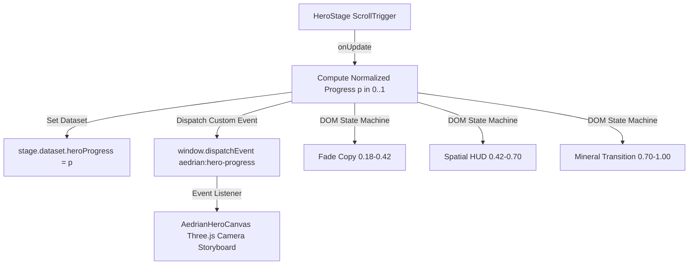

# Aedrian Ponce — Systems Architecture & Applied Mathematics Portfolio

[](https://astro.build)
[](https://threejs.org)
[](https://tailwindcss.com)
[](https://www.typescriptlang.org)
[](https://playwright.dev)
[](https://vitest.dev)

A clean-room, ultra-premium personal portfolio for **Aedrian Ponce (Dian)** — Systems Software Engineer and Applied Mathematics specialist at the University of the Philippines Los Baños (UPLB).

The site features a custom procedural 3D "A" monolith, atmospheric texture layers, responsive safe-zone framing, and an interactive systems architecture matrix.

---

## 🏛 Architectural Principles

1. **Discrete Systems with Mathematical Rigor**: Pure deterministic engineering, graph theory models ($A^*$, Dijkstra, Voronoi tessellations), and verifiable algorithmic invariants.
2. **Zero-Fluff Evidence Gating**: All case studies feature transparent artifact states, code specifications, real metrics, and architecture diagrams.
3. **Impeccable Visual Hierarchy**: Restrained obsidian ceramic, cold-arc palladium reflections, atmospheric film grain, and architectural coordinate grids inspired by high-craft digital studios.
4. **Demand-Driven WebGL Rendering**: Zero GPU idle cycles when offscreen or stationary; demand-rendered Three.js canvas with strict bounding-box calculations.

---

## 💎 Design System & Palette

| Token | Hex / Value | Semantic Role |
|---|---|---|
| `--color-void` | `#050607` | Deep void backdrop |
| `--color-dark-surface` | `#101214` | High-contrast mineral ceramic surface |
| `--color-dark-subtle` | `#181B1E` | Card frames and elevated modules |
| `--color-border-dark` | `#22262B` | Hairline grid and structural borders |
| `--color-mineral` | `#E7E4DC` | Light chapter transition backdrop |
| `--color-palladium` | `#C8CDD0` | Primary metallic inlay accents |
| `--color-signal` | `#8EBBC8` | Cold-arc laser highlights and active telemetry |

---

## 📐 Procedural 3D Monolith Pipeline

The signature 3D "A" mark is procedurally generated from scratch using a deterministic Blender Python script (`scripts/generate-aedrian-mark.py`).

### Coordinate System Transformation
Blender operates in a **Right-Handed Z-Up** coordinate space, while glTF 2.0 and Three.js operate in a **Right-Handed Y-Up** coordinate space. The runtime engine applies exact transformation mathematics:

$$\begin{pmatrix} X_{\text{Three}} \\ Y_{\text{Three}} \\ Z_{\text{Three}} \end{pmatrix} = \begin{pmatrix} X_{\text{Blender}} \\ Z_{\text{Blender}} \\ -Y_{\text{Blender}} \end{pmatrix}$$

### Responsive Framing & Safe Zones
- **Desktop ($\ge 1024$px)**: Visual center placed at $\approx 68\text{--}74\%$ of viewport width, reserving the left $0\text{--}55\%$ for headline, telemetry, and primary CTAs.
- **Tablet ($768\text{--}1023$px)**: Scaled model placed lower-right, ensuring copy and badge clearance.
- **Mobile ($< 768$px)**: Model framed in lower $40\text{--}45\%$ of viewport with $180\text{svh}$ smooth scroll travel, leaving the top half completely clear for typography.
- **Reduced Motion**: Instant static poster fallback aligned with 3D safe-zone framing.

---

## ⚡ Single ScrollTrigger Architecture



---

## 🛠 Tech Stack

- **Framework**: [Astro 5](https://astro.build) (Static Site Generation, Island Architecture)
- **Styling**: [Tailwind CSS v4](https://tailwindcss.com) (Modern CSS theme variables, zero arbitrary class bloat)
- **3D Graphics**: [Three.js](https://threejs.org) + [GLTFLoader](https://threejs.org/docs/#examples/en/loaders/GLTFLoader) (ACES Filmic Tone Mapping, PBR Shaders)
- **Interactive Islands**: [React 19](https://react.dev) (`SystemsExplorer.tsx`, `AedrianHeroCanvas.tsx`)
- **Animation & Scroll**: [GSAP](https://gsap.com) + [ScrollTrigger](https://gsap.com/scrolltrigger/)
- **Typography**: Bricolage Grotesque (Display), Instrument Sans (Body), Fragment Mono (Code/Telemetry)
- **Testing**: [Playwright](https://playwright.dev) (60+ responsive multi-viewport E2E tests), [Vitest](https://vitest.dev) (Unit & Schema tests)

---

## 🚀 Development & Verification

### Install Dependencies
```bash
npm install
```

### Local Development Server
```bash
npm run dev
```

### Production Build & Preview
```bash
npm run build
npm run preview
```

### Run Automated QA Suites
```bash
# Typecheck & Diagnostics
npm run check

# Unit, Privacy & Schema Tests
npm test

# Responsive & Multi-Viewport E2E Tests (320px, 390px, 768px, 1280px, 1440px)
npm run test:e2e

# Full Production Verification Pipeline
npm run verify
```

---

## 📂 Project Structure

```
businesses/aedrian-portfolio/
├── brand/                     # Blender master files (.blend)
├── docs/                      # Technical specifications & source manifests
├── public/
│   ├── brand/                 # Procedural 3D GLB, SVG silhouette, PNG renders
│   ├── fonts/                 # WOFF2 variable fonts
│   └── studies/               # Programmatic SVG system diagrams
├── src/
│   ├── assets/                # Static WebP fallbacks and media
│   ├── components/
│   │   ├── hero/              # 3D Monolith stage, canvas island, poster fallback
│   │   ├── systems/           # Interactive Systems Architecture Matrix island
│   │   ├── ui/                # Badges, section headings, evidence gates
│   │   ├── ChapterRail.astro  # Sticky HUD navigation rail
│   │   ├── Header.astro       # Architectural sticky navigation
│   │   └── Footer.astro       # Minimalist terminal footer
│   ├── content/
│   │   └── work/              # Markdown case studies (UPPETITE, AedriAIn, IMS, Aescent)
│   ├── layouts/               # Base layout with atmospheric texture engine
│   ├── pages/                 # Static routes (/, /work, /work/[id], /about, /404)
│   └── styles/global.css      # CSS theme variables, grain, grid, and reveal utilities
├── tests/
│   ├── e2e/                   # Playwright multi-viewport responsive suites
│   └── unit/                  # Vitest schema, privacy, and asset tests
├── astro.config.mjs
├── package.json
├── playwright.config.ts
└── tsconfig.json
```

---

## 📄 License & Attribution

Designed and engineered with mathematical precision for **Aedrian Ponce**. All rights reserved.